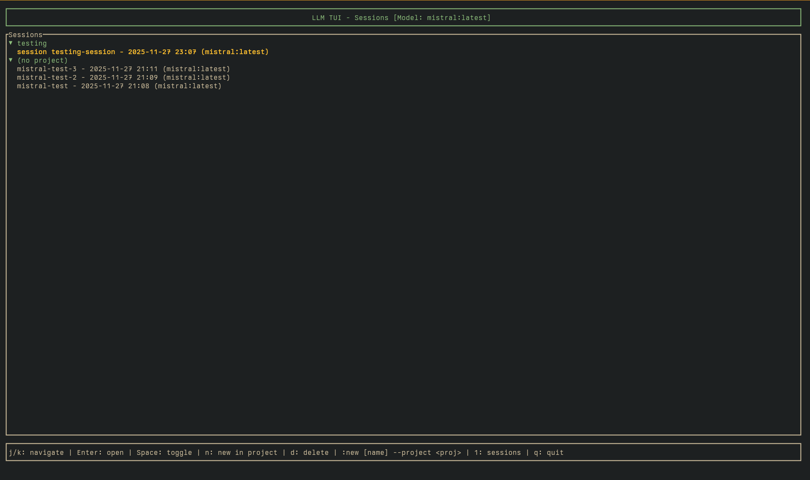
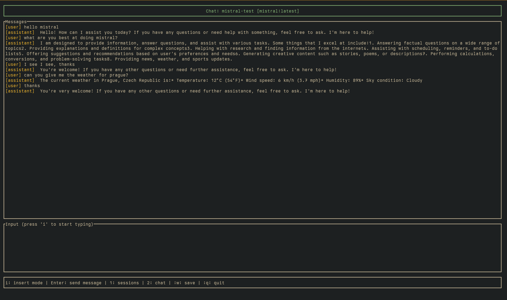

# LLM TUI

A terminal user interface for LLM chat sessions supporting Ollama, Claude (Anthropic), and AWS Bedrock. Features vim-style keybindings, session management, tool execution with confirmation, and persistent file context.

## Features

- **Multi-Provider Support**: Ollama (local models), Claude API (Anthropic), and AWS Bedrock
- **Tool System**: 6 built-in tools (Read, Write, Edit, Glob, Grep, Bash) with user confirmation
- **File Context Persistence**: Files read during sessions are cached and restored across restarts
- **Session Management**: Create, browse, rename, and delete chat sessions
- **Project Support**: Organize sessions by project
- **Vim Keybindings**: Modal editing (Normal/Insert/Command modes)
- **Ollama Integration**: Streaming responses from local models with automatic memory management
- **Unified Model Management**: Browse all providers (Ollama, Claude, Bedrock) in one screen, download Ollama models with one keypress
- **Token Tracking**: Real-time token usage display with automatic context compaction
- **Claude Code-Style UI**: Clean message formatting with colored bullets for different message types
- **Context Loading**: Import context from files or other sessions
- **SQLite Storage**: Efficient persistent storage with full conversation history
- **Autosave**: Configurable save modes (disabled, on-send, timer)






## Installation

### From crates.io (Recommended)

```bash
cargo install llm-tui-rs
```

Then run with:
```bash
llm-tui-rs
```

### Prerequisites
- [Ollama](https://ollama.ai) installed and running (for local models)
- Anthropic API key (optional, for Claude API)
- AWS credentials with Bedrock access (optional, for AWS Bedrock)

The app will auto-start Ollama if configured (see Configuration section).

### From Source

#### With Nix
```bash
git clone https://github.com/ducks/llm-tui
cd llm-tui
nix-shell
cargo build --release
./target/release/llm-tui-rs
```

#### Without Nix
```bash
git clone https://github.com/ducks/llm-tui
cd llm-tui
cargo build --release
./target/release/llm-tui-rs
```

## Usage

### Keybindings

**Global:**
- `1`: Sessions screen
- `2`: Chat screen (if session open)
- `3`: Models screen
- `?`: Help screen
- `q`: Quit

**Session List Screen:**
- `j/k` or `↓/↑`: Navigate sessions
- `g/G`: Jump to top/bottom
- `Enter`: Open selected session
- `Space`: Toggle project expand/collapse
- `n`: New session in current project
- `d`: Delete selected session

**Chat Screen:**
- `i`: Enter insert mode to type message
- `Esc`: Return to normal mode
- `Enter` (normal mode): Send message
- `Enter` (insert mode): Add newline
- `Ctrl+Space` (insert mode): Send message
- `j/k`: Scroll up/down (normal mode)
- `G`: Jump to bottom and resume auto-scroll

**Models Screen:**
- `j/k` or `↓/↑`: Navigate models (across all providers)
- `Enter`: Select installed model or download non-installed Ollama model
- Shows all providers: Ollama (local), Claude (API), Bedrock (AWS)
- Installed Ollama models marked with `[installed]`
- Current active model marked with `[current]`

### Commands

**Session Management:**
- `:new` - Create new session with datetime ID
- `:new my-session-name` - Create new session with custom name
- `:new project my-project` - Create/switch to project (no session created)
- `:rename my-new-name` - Rename current session
- `:delete-session` or `:ds` - Delete current session
- `:project discourse-yaks` - Set current project
- `:w` or `:save` - Save current session manually
- `:q` or `:quit` - Quit application

**Provider Management:**
- `:provider ollama` - Switch to Ollama (local models)
- `:provider claude` - Switch to Claude API (requires ANTHROPIC_API_KEY)
- `:provider bedrock` - Switch to AWS Bedrock (requires AWS credentials)

**Context Loading:**
- `:load filename.md` - Load context from a local file
- `:load session-name` - Load context from another session
  - Matches by exact ID, exact name, or partial name
  - Cannot load from current session

**Model Management:**
- `:models` - Open model management screen
- `:pull modelname` - Download a model from Ollama library
- `:delete modelname` - Remove an installed model

**Context Management:**
- `:compact` - Manually compact conversation (summarize old messages)

## Tool System

When using Claude or Bedrock providers, the AI can use these tools to interact with your system:

- **Read**: Read file contents (sandboxed to home directory)
- **Write**: Create or overwrite files
- **Edit**: Make targeted edits to existing files
- **Glob**: Find files by pattern (e.g., `*.rs`, `src/**/*.toml`)
- **Grep**: Search file contents with regex
- **Bash**: Execute shell commands (sandboxed to home directory, 2min timeout)

All tool executions require user confirmation (y/n/q). Tool results are cached per session, and files read during a session are automatically restored when reopening the session.

## Configuration

Config file location: `~/.config/llm-tui/config.toml`

Default configuration:
```toml
autosave_mode = "onsend"
autosave_interval_seconds = 30
ollama_url = "http://localhost:11434"
ollama_auto_start = true
ollama_model = "llama2"
ollama_context_window = 4096
default_llm_provider = "ollama"
claude_api_key = ""  # Set via ANTHROPIC_API_KEY env var
claude_model = "claude-3-5-sonnet-20241022"
claude_context_window = 200000
bedrock_model = "us.anthropic.claude-sonnet-4-20250514-v1:0"
bedrock_context_window = 200000
autocompact_threshold = 0.75
autocompact_keep_recent = 10
```

Settings:
- `autosave_mode`: How to save sessions (default: "onsend")
  - `"disabled"`: Manual save only (use `:w`)
  - `"onsend"`: Save immediately when sending messages
  - `"timer"`: Save every N seconds (see `autosave_interval_seconds`)
- `autosave_interval_seconds`: Timer interval in seconds (default: 30)
- `ollama_url`: Ollama server URL (default: "http://localhost:11434")
- `ollama_auto_start`: Auto-start Ollama server if not running (default: true)
- `ollama_model`: Default Ollama model (default: "llama2")
- `ollama_context_window`: Context window for Ollama models (default: 4096)
- `default_llm_provider`: Default provider on startup (default: "ollama")
- `claude_model`: Default Claude model (default: "claude-3-5-sonnet-20241022")
- `claude_context_window`: Context window for Claude models (default: 200000)
- `bedrock_model`: Default Bedrock model (default: "us.anthropic.claude-sonnet-4-20250514-v1:0")
- `bedrock_context_window`: Context window for Bedrock models (default: 200000)
- `autocompact_threshold`: Trigger compaction at this % of context window (default: 0.75)
- `autocompact_keep_recent`: Always keep this many recent messages uncompacted (default: 10)

The config file is automatically created with defaults on first run.

Examples:
```toml
# Save every 5 minutes
autosave_mode = "timer"
autosave_interval_seconds = 300

# Disable autosave entirely
autosave_mode = "disabled"
```

## Automatic Context Compaction

When conversations grow long, the TUI automatically summarizes old messages to stay within the model's context window. This happens at 75% capacity by default (configurable via `autocompact_threshold`).

How it works:
- Monitors token usage shown in chat header: `Tokens: 1250/200000 (0%)`
- At threshold (e.g., 75%), sends old messages to LLM for summarization
- Replaces compacted messages with concise summary (<500 tokens)
- Always keeps recent N messages uncompacted (default: 10)
- Summaries are always included in context, compacted messages filtered out

You can trigger compaction manually with `:compact` anytime. Use this to reduce token usage before hitting the limit.

## Session Storage

Sessions and messages are stored in a SQLite database at:
`~/.local/share/llm-tui/sessions.db`

Benefits:
- Efficient storage for long conversations
- Fast queries and filtering
- No system SQLite required (bundled with the binary)
- Single file to backup or sync

## Model Recommendations

### For Chat
- **mistral** - Fast, efficient, great for conversation
- **llama3.2** - Latest generation, excellent instruction following
- **phi3** - Microsoft's model, good balance of size and quality
- **qwen2.5** - Strong at reasoning and chat

### For Code
- **codellama** - Meta's code-specialized model
- **deepseek-coder** - Excellent at code generation and understanding
- **starcoder2** - Multi-language code model

### Note on Base Models
Models without `:chat` suffix (like `llama2`) are base models trained for text
completion, not conversation. They will try to continue your text rather than
respond as an assistant. Always use the `:chat` variant or dedicated chat
models for interactive use.

Examples:
- `llama2` - Base model (text completion)
- `llama2:chat` - Chat-tuned variant (conversation)

## Roadmap

- [x] Ollama integration with streaming responses
- [x] SQLite-based session storage
- [x] Configurable autosave modes
- [x] Unified model management (browse, download, select across all providers)
- [x] Model management commands (:models, :pull, :delete)
- [x] Context loading from files and sessions (:load)
- [x] Session rename and delete
- [x] Claude API integration
- [x] AWS Bedrock integration
- [x] Tool system (Read, Write, Edit, Glob, Grep, Bash) with ripgrep
- [x] Tool confirmation workflow
- [x] File context persistence across sessions
- [x] Token tracking and display
- [x] Automatic context compaction (conversation summarization)
- [x] Claude Code-style message formatting
- [x] Help screen (press ?)
- [x] GitHub Actions release workflow
- [ ] OpenAI API integration
- [ ] Setup wizard for API keys
- [ ] Daily notes integration
- [ ] Search functionality
- [ ] Session export
- [ ] Custom keybindings configuration
- [ ] Code block syntax highlighting
