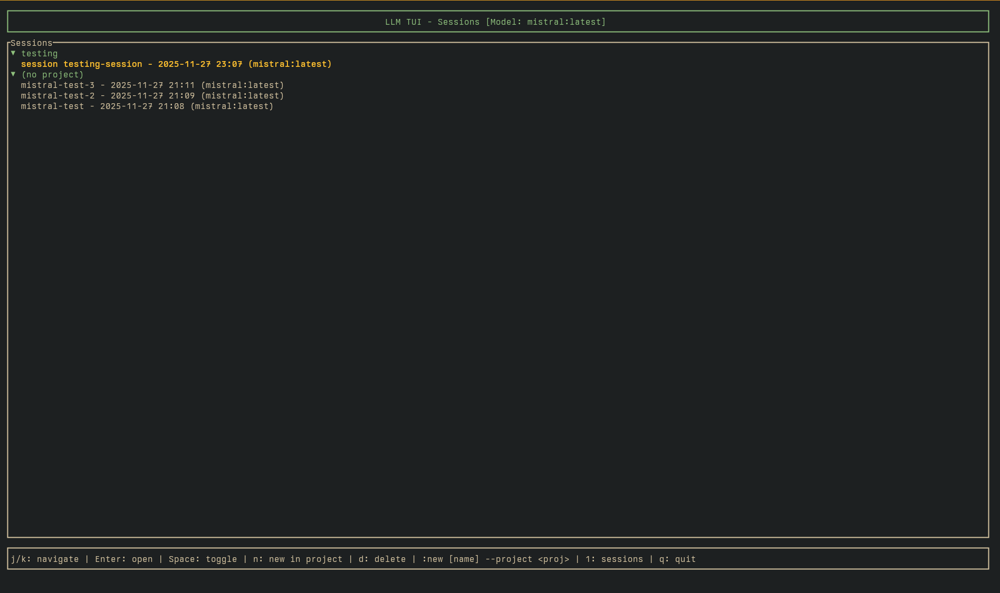
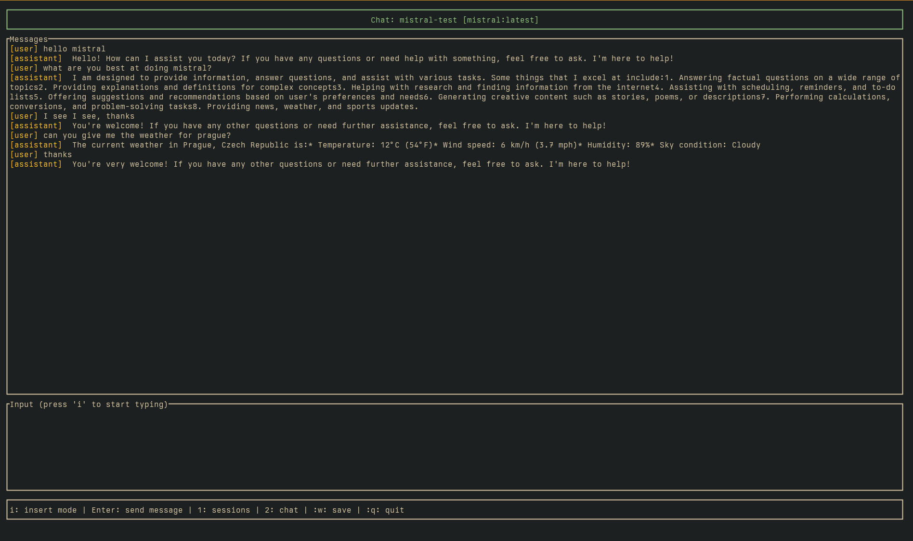

# LLM TUI

A terminal user interface for LLM chat sessions with multi-provider
support, vim-style keybindings, tool execution, and session management.

## Features

- **Multi-Provider Support**: Ollama, Anthropic (Claude), OpenAI,
  Gemini, AWS Bedrock, and any OpenAI-compatible endpoint (vLLM,
  llama.cpp, OpenRouter, etc.)
- **Provider Management**: Dedicated screen to view, test, set
  defaults, and delete providers
- **Model Management**: Browse models across providers, pull/delete
  Ollama models, enter custom model IDs
- **Tool System**: 6 built-in tools (Read, Write, Edit, Glob, Grep,
  Bash) with user confirmation
- **File Context Persistence**: Files read during sessions are cached
  and restored across restarts
- **Session Management**: Create, browse, rename, and delete chat
  sessions
- **Project Support**: Organize sessions by project
- **Vim Keybindings**: Modal editing (Normal/Insert/Command modes)
- **Ollama Integration**: Streaming responses from local models with
  automatic memory management and auto-start
- **Token Tracking**: Real-time token usage display with automatic
  context compaction
- **Claude Code-Style UI**: Clean message formatting with colored
  bullets for different message types
- **Context Loading**: Import context from files or other sessions
- **SQLite Storage**: Efficient persistent storage with full
  conversation history
- **Autosave**: Configurable save modes (disabled, on-send, timer)
- **Flexible Auth**: API keys via direct value, environment variable,
  or shell command (`api_key_cmd`)






## Installation

### From crates.io (Recommended)

```bash
cargo install llm-tui-rs
```

Then run with:
```bash
llm-tui-rs
```

### Prerequisites
- [Ollama](https://ollama.ai) installed and running (for local models)
- API keys for cloud providers (optional, see Configuration)
- AWS credentials with Bedrock access (optional)

The app will auto-start Ollama if configured (see Configuration
section).

### From Source

#### With Nix
```bash
git clone https://github.com/ducks/llm-tui
cd llm-tui
nix-shell
cargo build --release
./target/release/llm-tui-rs
```

#### Without Nix
```bash
git clone https://github.com/ducks/llm-tui
cd llm-tui
cargo build --release
./target/release/llm-tui-rs
```

## Usage

### Keybindings

**Global:**
- `1`: Sessions screen
- `2`: Chat screen (if session open)
- `3`: Providers screen
- `4`: Models screen
- `?`: Help screen
- `q`: Quit

**Session List Screen:**
- `j/k` or Arrow keys: Navigate sessions
- `g/G`: Jump to top/bottom
- `Enter`: Open selected session
- `Space`: Toggle project expand/collapse
- `n`: New session in current project
- `d`: Delete selected session

**Chat Screen:**
- `i`: Enter insert mode to type message
- `Esc`: Return to normal mode
- `Enter` (normal mode): Send message
- `Enter` (insert mode): Add newline
- `Ctrl+Space` (insert mode): Send message
- `j/k`: Scroll up/down (normal mode)
- `G`: Jump to bottom and resume auto-scroll

**Providers Screen:**
- `j/k` or Arrow keys: Navigate providers
- `s`: Set selected provider as default
- `t`: Test provider connection
- `d`: Delete provider (with y/n confirmation)
- `Enter`: Jump to Models screen filtered to that provider

**Models Screen:**
- `j/k` or Arrow keys: Navigate models
- `Enter`: Select model for current session
- `p`: Pull model (Ollama only)
- `x`: Delete model (Ollama only)
- `c`: Enter custom model ID
- `f`: Cycle provider filter
- `Tab`: Jump to next provider section

### Commands

**Session Management:**
- `:new` - Create new session with datetime ID
- `:new my-session-name` - Create new session with custom name
- `:new project my-project` - Create/switch to project
- `:rename my-new-name` - Rename current session
- `:delete-session` or `:ds` - Delete current session
- `:project discourse-yaks` - Set current project
- `:w` or `:save` - Save current session manually
- `:q` or `:quit` - Quit application

**Provider Management:**
- `:provider ollama` - Switch to a provider by name
- `:providers` - Open Providers screen

**Context Loading:**
- `:load filename.md` - Load context from a local file
- `:load session-name` - Load context from another session

**Model Management:**
- `:models` - Open Models screen
- `:pull modelname` - Download a model from Ollama library
- `:delete modelname` - Remove an installed Ollama model

**Context Management:**
- `:compact` - Manually compact conversation (summarize old messages)

## Tool System

When using providers that support tool use, the AI can use these tools
to interact with your system:

- **Read**: Read file contents (sandboxed to home directory)
- **Write**: Create or overwrite files
- **Edit**: Make targeted edits to existing files
- **Glob**: Find files by pattern (e.g., `*.rs`, `src/**/*.toml`)
- **Grep**: Search file contents with regex
- **Bash**: Execute shell commands (sandboxed to home directory,
  2min timeout)

All tool executions require user confirmation (y/n/q). Tool results
are cached per session, and files read during a session are
automatically restored when reopening the session.

## Configuration

Config file location: `~/.config/llm-tui/config.toml`

Providers are configured under `[providers.<name>]` sections. Each
provider needs a `type` field and provider-specific settings.

### Example configuration

```toml
autosave_mode = "onsend"
autosave_interval_seconds = 30
default_provider = "ollama"
autocompact_threshold = 0.75
autocompact_keep_recent = 10

[providers.ollama]
type = "ollama"
base_url = "http://localhost:11434"
model = "llama3.2:latest"
context_window = 4096
auto_start = true

[providers.claude]
type = "anthropic"
api_key_env = "ANTHROPIC_API_KEY"
model = "claude-sonnet-4-20250514"
context_window = 200000

[providers.bedrock]
type = "bedrock"
model = "us.anthropic.claude-sonnet-4-20250514-v1:0"
context_window = 200000

[providers.openai]
type = "openai"
api_key_env = "OPENAI_API_KEY"
model = "gpt-4o"
context_window = 128000

[providers.gemini]
type = "gemini"
api_key_env = "GEMINI_API_KEY"
model = "gemini-2.5-pro"
context_window = 1000000

[providers.my-vllm]
type = "openai_compatible"
base_url = "https://my-server.example.com/v1"
api_key_cmd = "op read 'op://Vault/Item/credential'"
model = "Qwen/Qwen3.5-122B-A10B"
context_window = 200000
max_output_tokens = 50000
```

### Provider types

| Type | Description | Auth |
|------|-------------|------|
| `ollama` | Local Ollama server | None (local) |
| `anthropic` | Anthropic Claude API | API key |
| `openai` | OpenAI API | API key |
| `openai_compatible` | Any OpenAI-compatible endpoint | API key |
| `gemini` | Google Gemini API | API key |
| `bedrock` | AWS Bedrock | AWS credentials (env/profile) |

### Common fields

All providers support these fields:
- `model` - Model identifier
- `context_window` - Token limit for the model
- `max_output_tokens` - Maximum tokens per response (default: 4096)

### API key resolution

For providers that need authentication, keys are resolved in order:
1. `api_key` - Direct value in config
2. `api_key_cmd` - Shell command that outputs the key (e.g., 1Password
   CLI, Vault, etc.)
3. `api_key_env` - Environment variable name

```toml
# Direct value (not recommended for shared configs)
api_key = "sk-..."

# Shell command (recommended for secret managers)
api_key_cmd = "op read 'op://Vault/Item/credential'"

# Environment variable
api_key_env = "ANTHROPIC_API_KEY"
```

### Global settings

- `autosave_mode`: `"disabled"`, `"onsend"` (default), or `"timer"`
- `autosave_interval_seconds`: Timer interval (default: 30)
- `default_provider`: Provider name to use on startup
- `autocompact_threshold`: Trigger compaction at this % of context
  window (default: 0.75)
- `autocompact_keep_recent`: Keep this many recent messages
  uncompacted (default: 10)

The config file is automatically created with defaults on first run.
Legacy flat configs (pre-provider format) are automatically migrated.

## Automatic Context Compaction

When conversations grow long, the TUI automatically summarizes old
messages to stay within the model's context window. This happens at
75% capacity by default (configurable via `autocompact_threshold`).

How it works:
- Monitors token usage shown in chat header:
  `Tokens: 1250/200000 (0%)`
- At threshold (e.g., 75%), sends old messages to LLM for
  summarization
- Replaces compacted messages with concise summary (<500 tokens)
- Always keeps recent N messages uncompacted (default: 10)
- Summaries are always included in context, compacted messages
  filtered out

You can trigger compaction manually with `:compact` anytime.

## Session Storage

Sessions and messages are stored in a SQLite database at:
`~/.local/share/llm-tui/sessions.db`

Benefits:
- Efficient storage for long conversations
- Fast queries and filtering
- No system SQLite required (bundled with the binary)
- Single file to backup or sync

## Model Recommendations

### For Chat
- **mistral** - Fast, efficient, great for conversation
- **llama3.2** - Latest generation, excellent instruction following
- **phi3** - Microsoft's model, good balance of size and quality
- **qwen2.5** - Strong at reasoning and chat

### For Code
- **codellama** - Meta's code-specialized model
- **deepseek-coder** - Excellent at code generation and understanding
- **starcoder2** - Multi-language code model

### Note on Base Models
Models without `:chat` suffix (like `llama2`) are base models trained
for text completion, not conversation. They will try to continue your
text rather than respond as an assistant. Always use the `:chat`
variant or dedicated chat models for interactive use.

## Roadmap

- [x] Ollama integration with streaming responses
- [x] SQLite-based session storage
- [x] Configurable autosave modes
- [x] Model management commands (:models, :pull, :delete)
- [x] Context loading from files and sessions (:load)
- [x] Session rename and delete
- [x] Claude API integration
- [x] AWS Bedrock integration
- [x] OpenAI API integration
- [x] Google Gemini integration
- [x] OpenAI-compatible endpoint support (vLLM, llama.cpp, etc.)
- [x] Tool system (Read, Write, Edit, Glob, Grep, Bash) with ripgrep
- [x] Tool confirmation workflow
- [x] File context persistence across sessions
- [x] Token tracking and display
- [x] Automatic context compaction (conversation summarization)
- [x] Claude Code-style message formatting
- [x] Help screen (press ?)
- [x] GitHub Actions release workflow
- [x] Provider management screen
- [x] Dynamic model listing from API endpoints
- [x] Configurable max output tokens per provider
- [x] Shell command API key resolution (api_key_cmd)
- [ ] Setup wizard for API keys
- [ ] Daily notes integration
- [ ] Search functionality
- [ ] Session export
- [ ] Custom keybindings configuration
- [ ] Code block syntax highlighting
